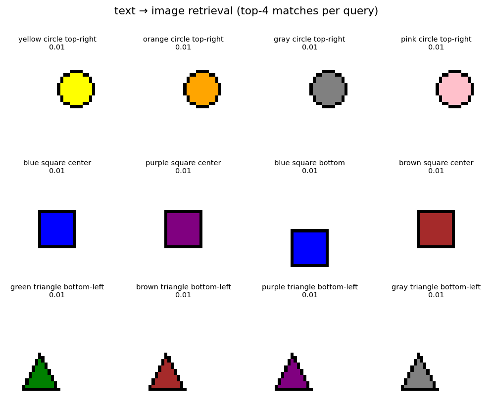

# nanoVLM from scratch

A compact, from-scratch implementation of a **dual-encoder contrastive image–text model** — the
CLIP training recipe — built on a fully synthetic dataset of coloured geometric shapes. A vision encoder and the text encoder are trained to project matching image/caption pairs to nearby points in a
shared embedding space, which makes **text → image** and **image → text** retrieval possible.

The project is deliberately small and readable: no pretrained weights, no external datasets, and a
clean pipeline-based structure you can run end-to-end on a laptop CPU in under a minute.



*Each row is a text query; the four images are the closest matches the model retrieves from the
gallery. The exact match is ranked first in every case, with same-shape / same-position items
filling the remaining slots.*

---

## What it does

The model never *generates* pixels or captions. It learns an alignment, and everything is built on
comparing embeddings:

- **text → image** — type `"red circle top-right"`, get back the closest images from a pool.
- **image → text** — hand it an image, get back the best-matching captions.
- Because captions are compositional (`{color} {shape} {position}`), the model learns each concept
  independently and composes them at query time.

## Highlights

- **Three explicit pipelines** — `DataPipeline`, `TrainingPipeline`, `RetrievalPipeline` — so each
  stage can be run, tested, or swapped on its own.
- **Learned temperature** (the CLIP `logit_scale` trick) rather than a fixed constant.
- **Symmetric InfoNCE loss** — each image must match its caption and vice versa.
- **Training stabilisers**: gradient clipping, cosine LR schedule, and best-on-validation
  checkpoint restore.
- **Robust query handling** — a normalisation layer maps loose phrasing onto trained tokens
  (`"right top" → "top-right"`, `"middle" → "center"`) and drops stop-words like `on`, so messy
  inputs don't crash the tokenizer.
- A single `Config` dataclass holds every knob; runnable as a **script** or an **interactive
  notebook**.

## Results

Trained for 60 epochs on the full 243-pair synthetic gallery (9 colours × 3 shapes × 9 positions),
CPU-only:

| Metric | Value |
|---|---|
| Image–caption pairs | 243 |
| Vocabulary size | 22 |
| Best validation loss | ~0.17 |
| Gallery top-1 retrieval accuracy | **0.77** |

> The softmax scores in the demo print as `0.01` because they are normalised over all 243 gallery
> items (uniform chance ≈ 0.004). What carries the signal is the **ranking**, not the absolute
> number — the correct item is ranked first.

## Project structure

```
nanoVLM-from-scratch/      
├── nanoVLM_code.ipynb   # same code as an interactive notebook, with plots
├── requirements.txt
├── assets/
│   └── retrieval_demo.png
├── LICENSE
└── README.md
```

## Installation

```bash
git clone https://github.com/<your-username>/nanoVLM-from-scratch.git
cd nanoVLM-from-scratch
pip install -r requirements.txt
```

## Usage

**As a script:**

```bash
```

Available flags: `--epochs`, `--batch-size`, `--embed-dim`, `--lr`, `--seed`.

**As a library:**

```python
from contrastive_shapes import (
    Config, seed_everything, DataPipeline,
    DualEncoderCLIP, TrainingPipeline, RetrievalPipeline,
)

cfg = Config(epochs=60)
seed_everything(cfg.seed)

data = DataPipeline(cfg)
train_loader, val_loader = data.build_loaders()

model = DualEncoderCLIP(cfg, vocab_size=len(data.tokenizer))
TrainingPipeline(model, cfg).fit(train_loader, val_loader)

engine = RetrievalPipeline(model, data.tokenizer, cfg).index(data.images, data.captions)
print(engine.text_to_image("red circle top-right", k=3))
print("top-1 accuracy:", engine.top1_accuracy())
```

**As a notebook:** open `contrastive_shapes.ipynb` in Jupyter or Colab and run all cells — it
renders sample shapes, trains, reports accuracy, and visualises retrievals inline.

## How it works

1. **Data** — `DataPipeline` renders every `(color, shape, position)` combination to a 32×32 image
   and pairs it with a caption. Positions are resolved through an explicit `(x-band, y-band)`
   lookup rather than fragile string matching.
2. **Encoders** — a small conv stack (global-average-pooled) for images; token + positional
   embeddings with one self-attention block and a `[CLS]` readout for text. Both project to a
   unit-normalised shared space.
3. **Training** — a symmetric contrastive loss pulls matching pairs together and pushes
   mismatched pairs apart, scaled by a learned temperature.
4. **Retrieval** — `RetrievalPipeline` pre-encodes a gallery once, after which every query is a
   single matrix multiply followed by a top-k lookup.

## References & acknowledgements

This project was built as a learning exercise while following the **Vizuara** videos and notes by
**Dr. [Sreedath Panat]**, whose explanations of
vision–language models and contrastive learning informed the approach here.

The underlying technique — contrastive alignment of image and text embeddings — follows the CLIP
line of work (Radford et al., *Learning Transferable Visual Models From Natural Language
Supervision*, 2021). This repository is an independent, from-scratch educational reimplementation on
synthetic data and does not reuse any third-party model code or weights.

## License

Released under the [MIT License](LICENSE).
